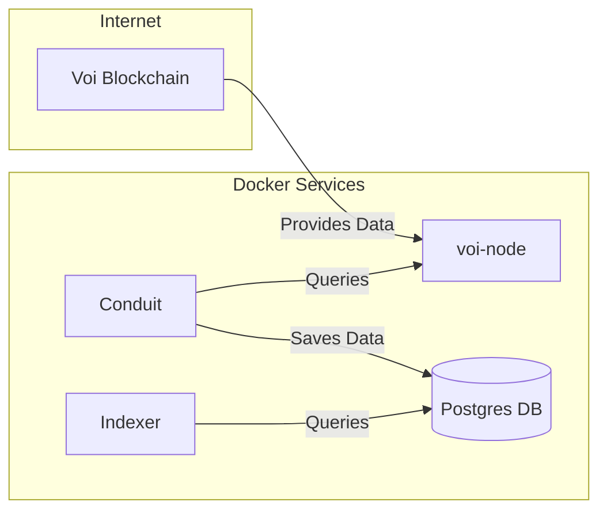

# Indexer Docker Compose Example Setup Guide

This project includes a Docker Compose file and necessary configurations to run an indexer on the Voi network.

## Overview of Docker Servuces
The Docker Compose file defines the following servers:

1. **voi-node**: This service connects to the Voi network by running a node.
2. **conduit**: This service retrieves data from the **voi-node** and stores it in a Postgres database.
2. **postgres**: This service runs the Postgres database to store data processed by the Conduit service. The data is persisted on a Docker volume.
2. **indexer**: This service retrieves data from the Postgres database.



## How to Run the Project

```sh
docker compose up -d
```

## How to Stop the Project

```sh
docker compose down
```

## Accessing the Indexer 

Once the indexer is up, you can query it via this example command:

```sh
curl http://localhost:8980/v2/accounts
```

## Network Syncing Process

The voi-node service will begin syncing with the Voi network. 
The conduit service will continue advancing the block processing as syncing progresses, which may take some time.

You can check the current sync status with the following command:

```bash
docker exec -it indexer-voi-node-1 /node/bin/goal -d /algod/data node status
```

## Token configuration

The voi-node service utilizes two tokens, stored in the following files:

- `algod-data/algod.token`
- `algod-data/algod.admin.token`

These tokens are also referenced in `conduit-data/conduit.yml`.

To generate a new token, run this command:

```bash
head -c 32 /dev/urandom | shasum -a 256 | cut -d ' ' -f 1
```

Once generated, be sure to update the corresponding configuration files.

## Postgres Configuration

Postgres connection strings and default credentials are located within the `docker-compose.yml` file. 
Additionally, you can find the Postgres connection settings in `conduit-data/conduit.yml`.

## Conduit Configuration

Documentation on the conduit configuration can be found [here](https://github.com/algorand/conduit?tab=readme-ov-file#create-conduityml-configuration-file)

## Indexer Configuration

Documentation on the indexer configuration can be found [here](https://github.com/algorand/indexer?tab=readme-ov-file#disabling-parameters)

## Indexer REST API Documentation

Comprehensive documentation for the Indexer REST API is available [here](https://developer.algorand.org/docs/rest-apis/indexer/)
