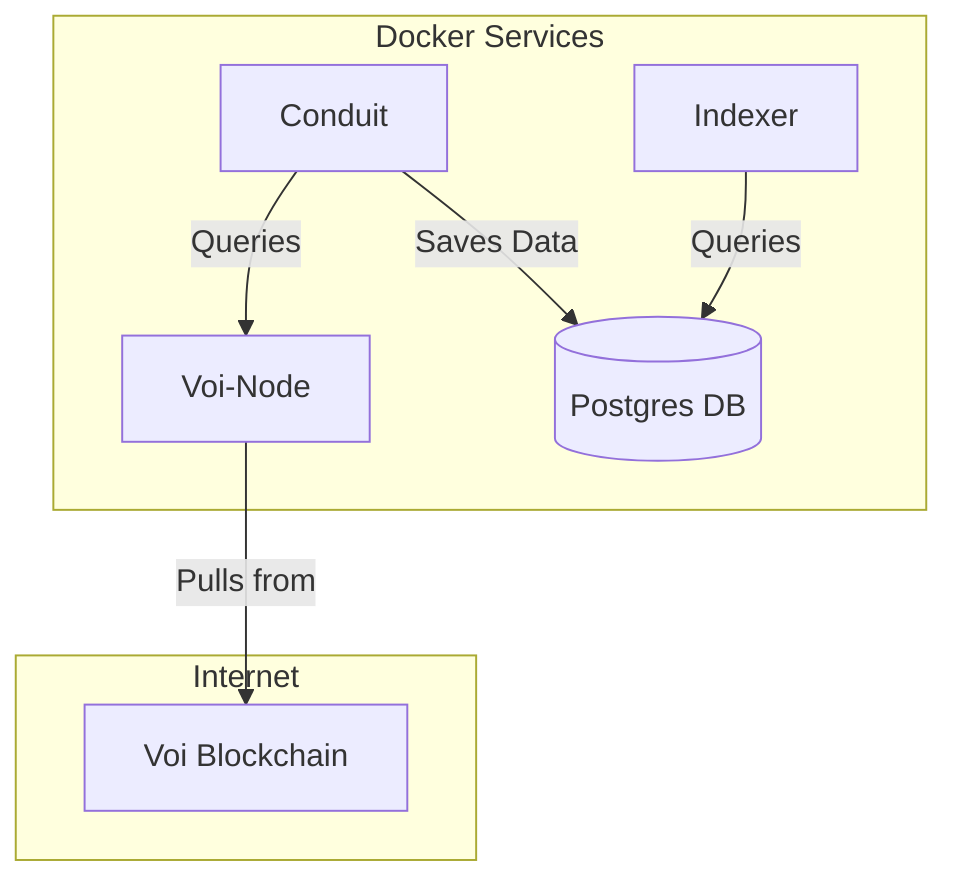

# Indexer Docker Compose example

This project contains a Docker compose file and configurations for running an indexer on the network.

The Docker Compose file defines the following servers:

1. **voi-node**: This service runs the node that connects to the Voi network.
2. **conduit**: This service runs the Conduit service that fetches data from **voi-node** and stores data in a Postgres db.
2. **postgres**: This service runs the Postgres db that stores the data processed by the Conduit service. Data is stored on a Docker volume.
2. **indexer**: This service runs the indexer that fetches data from the Postgres db.



## Running the project

```sh
docker compose up -d
```

## Stopping the project

```sh
docker compose down
```

## Connecting to the indexer

```sh
curl http://localhost:8980/v2/accounts
```

## Catching up with the network

The voi-node service will start syncing with the network, with the conduit service advancing blocks.
This may take an extended period of time.

The current status can be checked by running the following command:

```bash
docker exec -it indexer-voi-node-1 /node/bin/goal -d /algod/data node status
```

## Token configuration

The `voi-node` service has two tokens configured in `./algod-data/algod.token` and `./algod-data/algod.admin.token`.
These tokens are used from with `conduit-data/conduit.yml`, and should be rotated.

To generate a single new token, run the following command:

```bash
head -c 32 /dev/urandom | shasum -a 256 | cut -d ' ' -f 1
```

After running the tool update configuration files listed above.

## Postgres configuration

The Postgres connection strings and default credentials can be found in the `docker-compose.yml` file, 
as well as with `conduit-data/conduit.yml` containing connection strings.

## Conduit configuration

Documentation on the conduit configuration can be found [here](https://github.com/algorand/conduit?tab=readme-ov-file#create-conduityml-configuration-file)

## Indexer configuration

Documentation on the indexer configuration can be found [here](https://github.com/algorand/indexer?tab=readme-ov-file#disabling-parameters)

## Indexer REST API documentation

The indexer REST API documentation can be found [here](https://developer.algorand.org/docs/rest-apis/indexer/)